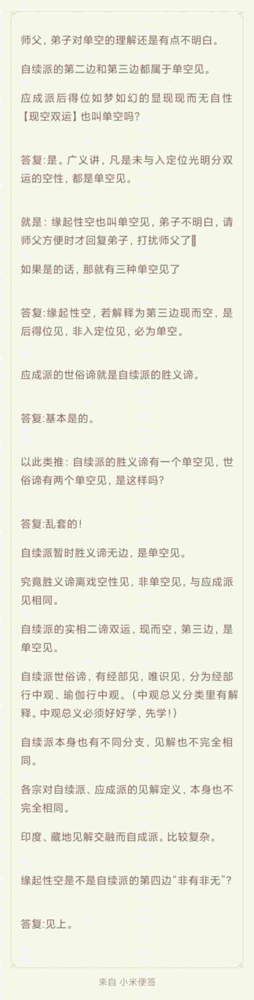
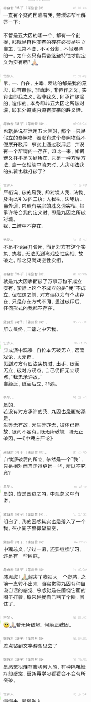
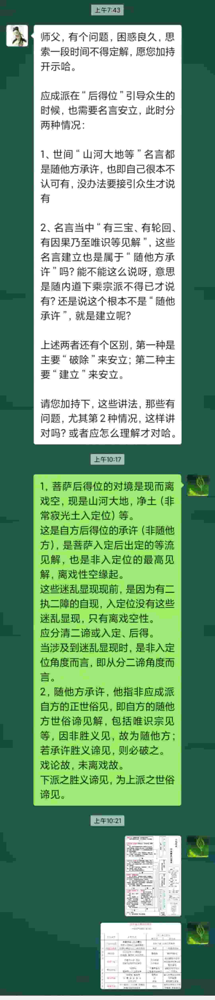
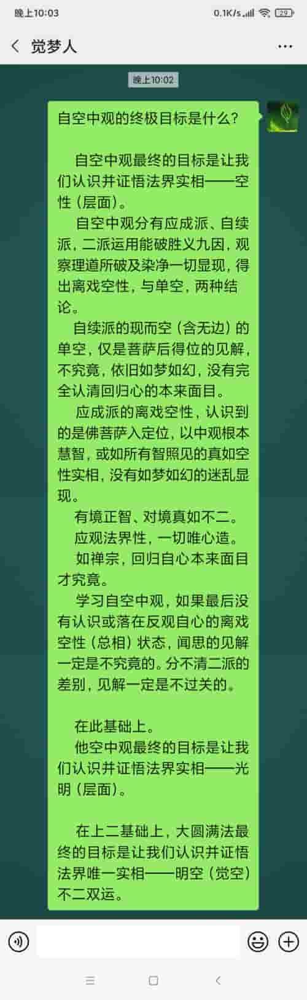

|#|解答|
|-|-|
|001||
|002|||
|003|||
|004|||
|005|||
|006|||
|007|||
|008|||
|009|||
|010|||
|011|||
|012|||
|013|||
|014|||
|015|||
|016|
|017|
|018|
|019|
|020|
|020|
|020|
|020|
|020|
|020|
|020|
|020|
|020|

