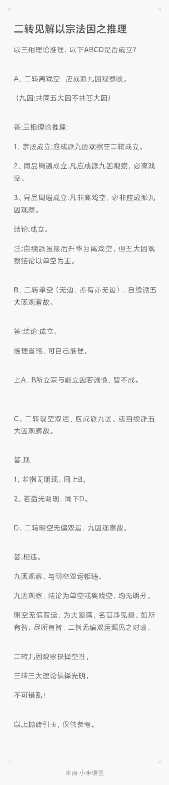
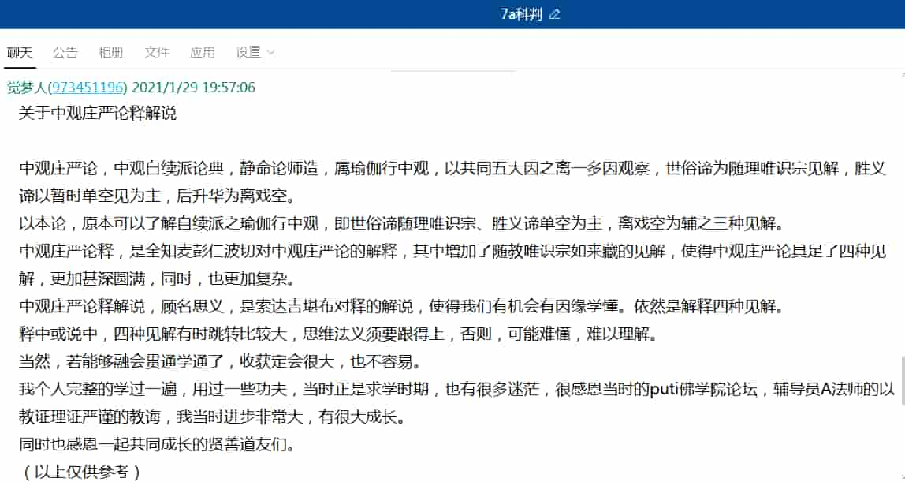
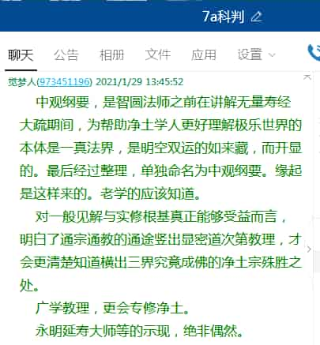
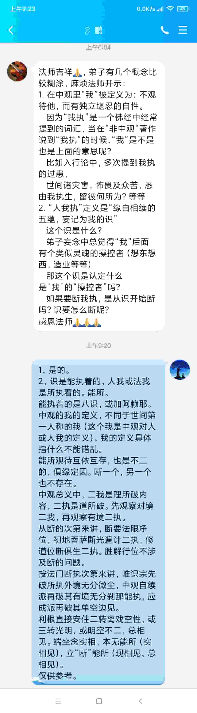
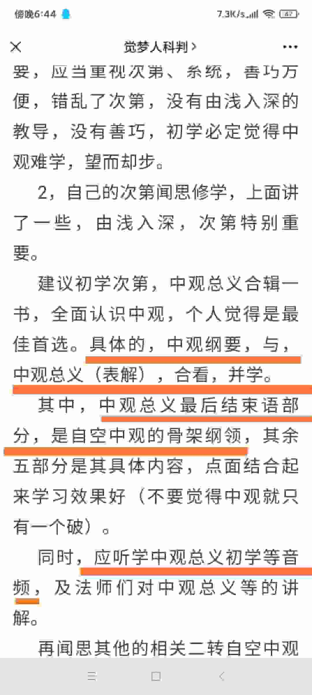

|#|解答|
|-|-|
|001|关于单空、缘起
|||
|002|二转应成派入定位能照见众生痛苦吗？
||||
|003|二转见解以宗法因之推理
||||
|004|理所破和道所破相关、为何破显现
||||
|005|三转论典学习次第
||||
|006|关于中观庄严论释解说
||||
|007|中观纲要缘起，中观与净土
||||
|008|见 不坏宗派
||||
|009|中观的我与世间第一人称的我定义不同
||||
|010|瓶子不空实有空与自续派见
||||
|011|一心三观与大圆满的关系
||||
|012|中观纲要与总义表解并学+听学初学音频
||||
|013|第二转法轮的缺陷
||||
|014|佛陀色身是二转的世俗三转的胜义？
||||
|015|阿赖耶 阿赖耶识 觉性之差别
||||
|016|若无所破境，何须正破因
||
|017|
|018|
|019|
|020|
|020|
|020|
|020|
|020|
|020|
|020|
|020|
|020|

