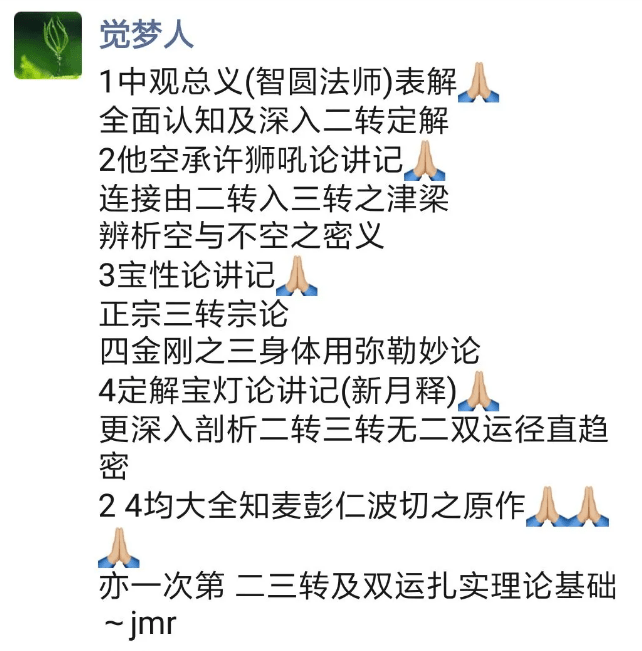

[<<<主页面](../index.md)

# 如何学好中观——致中观初学

——释道净 2稿 2018-11-14

 
师长的善巧引导，祈祷上师三宝加持，多念文殊菩萨心咒，正确的学习方法，从浅入深合适的次第，对基础名词概念必有明白定解，有点有面结合学习，加上自己的精进努力。  
中观比净土好学，中观虽然讲的是实相的智慧，但是以总相可以现量觉受，很多推理可以现量观察到，而净土现相即使总相也无法现量观察到。    
初学等感觉中观难学，原因是多方面的，个人体会应该注意以下几方面及建议，仅供参考。    
1. 师长的善巧引导。初学往往都会报班系统次第跟学，或自己找资料学习，所以师长的引导尤其重要，应当重视次第、系统，善巧方便，错乱了次第，没有由浅入深的教导，没有善巧，初学必定觉得中观难学，望而却步。  
2. 自己的次第闻思修学，上面讲了一些，由浅入深，次第特别重要。  
    + 建议初学次第，中观总义合辑一书，全面认识中观，个人觉得是最佳首选。具体的，中观纲要，与，中观总义（表解），合看，并学。  
    其中，中观总义最后结束语部分，是自空中观的骨架纲领，其余五部分是其具体内容，点面结合起来学习效果好（不要觉得中观就只有一个破）。  
    + 同时，应听学中观总义初学等音频，及法师们对中观总义等的讲解。  
    + 再闻思其他的相关二转自空中观的内容，如中观的三部根本论典，逐渐圆满圆融。  
    **以上二转自空中观为基础**。  
    + 有能力的，至少了解下二转分为中观、现观，对应为显义、隐义；对境空性、有境智慧；胜义量、名言量等关系。自空中观以应成派、自续派为主，及其差别。  
    + 还有三转如来藏他空中观（《大乘无上续论宝性论》讲记等如来藏系论典）分为随理唯识宗、随教唯识宗，其了义与不了义、与二转自空中观对自、他、空、不空的确切定义（《他空承许狮吼论》讲记）等等，相同与不同差别关系，关键点重点都明确有定解了，二转、三转明空双运圆融无违的总相定解就会自然呈现了。  
    菩提道、密宗道皆有次第，中观亦有次第。  
3. 必依教证、理证。凡夫眼耳鼻六根八识非量，故必依教证、理证建立正量，教证依了义不依不了义，厘清了义与不了义之教证。理证为三相推理。初学必依教证、理证转变自相续树立正量正见定解。  
讨论亦必依教证理证，依法不依人。  
4. 务必听懂、学懂，弄懂初学的每个名词概念，及时解决疑难问题，逐步建立定解，不囫囵吞枣，不急于求成。否则，后续运用名词概念的时候，会越来越糊涂，全部都不懂，自然没有信心失败了。
5. 名词概念，往往是多义词。一个名词概念，在不同的语境下，有各种不同的解释很正常，不必强求一致。  
例如：常乐我净，或我，在初转、二转皆破，为实有四边自性之义，二转胜义量应成见无二谛无我离戏；三转为名言净见量，以尽所有智照见本有谛实立常有如来藏之我（非外道神我，初、二转已破）。  
二量不分，必至相违；一词多义，本即圆融。

想到如上几点，和大家分享一下，法义正见定解是慢慢积累而成的，滴水穿石，铁杵成针！
